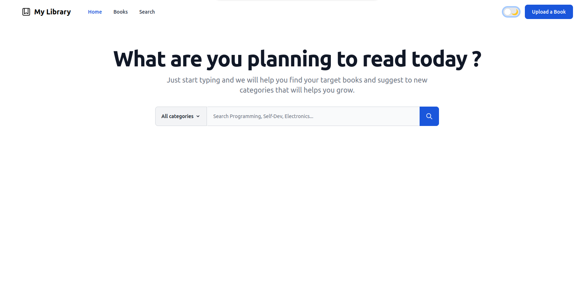

# Developer Library

Library with all functionality to save, organize and access any resources.

## Features - (MVP #1)

- CRUD operations
- Live Search
- Single Page Application
- Light/dark themes

## Run Locally

Clone the project

```bash
  git clone https://github.com/ojpro/my-library.git
```

Go to the project directory

```bash
  cd my-library
```

Install dependencies

```bash
  composer install
  npm install
```

Configure database connection

```bash
  cp .env.example .env
  # Edit .env file on any text editor and
  # set connection variables
  vi .env
```

Migrate database

```bash
  php artisan migrate
```

Start the server

```bash
  npm run dev
```

🎉 I hope you like the first version (Simplest one).

## Running Tests

To run tests, run the following command

```bash
  php artisan test
```

## Screenshots - (Preview)



## Roadmap

- [ ] Set Book Thumbnail
- [ ] Create Categories
- [ ] Add Authors
- [ ] Rating

### Long-Term Features

- [ ] More media support

- [ ] Store Code Snippets

- [ ] Annotation

## License

[MIT](https://choosealicense.com/licenses/mit/)

